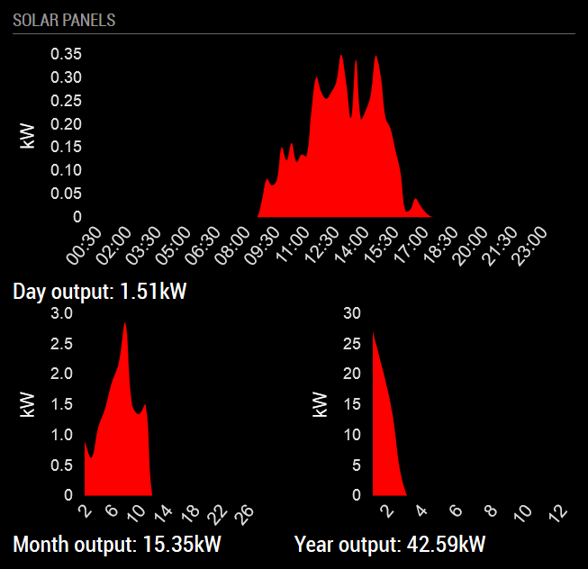

## MagicMirror Module: SunnyPortal

Display your SunnyPortal Solar Panel Inverter output

| Status | Version | Date | 
|:------- |:------- |:---- |
| Working | 1.0.0 | 2020-01-28 |

#### What is this module doing?

*MMM-SunnyPortal* is a [MagicMirror](https://github.com/MichMich/MagicMirror) module for displaying the 
current, monthly and yearly power output of your SunnyPortal Solar Panels. 

### Example Screenshots

Module Screenshot:



The displayed data shown above is fetched through the SunnyPortal website [SunnyPortal](https://www.sunnyportal.com)


---

### Dependencies

This module depends on the following *npm* packages:

* [request](https://github.com/request/request)  - Simplified HTTP client
* [flow](https://github.com/willconant/flow-js)  - Makes it easy to express multi-step asynchronous logic in Node or the browser
* [chartjs](https://github.com/chartjs/Chart.js) - Simple yet flexible JavaScript charting for designers & developers.

These are also listed in the `package.json` file and should be installed automatically when using *npm*.
However, those may require other packages. 

---

### Installation

Manual Installation:

```bash
cd ~/MagicMirror/modules
git clone https://github.com/linuxtuxie/MMM-SunnyPortal.git
cd MMM-SunnyPortal
```

Next install the dependencies: *request*, *flow* and *chartjs*, by running:

```bash
npm install request --save
npm install flow --save
npm install chart.js --save

```

Alternatively, on a *unix* based distribution, you can try to install all the above mentioned dependencies with the Bash script:

```bash
chmod 755 install_deps.sh
./install_deps.sh
```

---

### Configuration 

To configure the SunnyPortal module, you need to do the following:

1. Add the Module to the global MagicMirror `config.js` 
2. Edit the global config to add the username and password values for your SunnyPortal installation
3. [optional] Modify `MMM-SunnyPortal.css` to your own CSS taste
4. [optional] Add your own language translation file in the translations folder (currently english, dutch and french are provided)


Add the module to the modules array in the `config/config.js` file by adding the following section. 

```javascript
{
    module: 'MMM-SunnyPortal',
    position: 'bottom_left',
    header: 'Solar Panels',                     // The header text above the module. Use: "" to remove.
    config: {
        url: 'https://www.sunnyportal.com',     // The SunnyPortal website's URL
        updateInterval: 900,                    // How many times do we update the graphs? 
                                                // Note: Do not update too frequently or you will get locked out
                                                // 15 Minutes is ideal and also kept as a minimum!
        username: '',                           // Username for logging into https://www.sunnyportal.com/
        password: '',                           // Password for logging into https://www.sunnyportal.com/
        width: 500,                             // The total width of the module
        height: 400,                            // The total height of the module
        convertUnits: true,                     // Convert kwH to MWh if needed (when kWh value > 1000)
    }
},
```

---

#### Configuration Options 

| Option            | Default                       | Description  |
|:----------------- |:----------------------------- |:------------ | 
| url               | https://www.sunnyportal.com   | The SunnyPortal website's URL |
| updateInterval    | `900`                         | Module data update rate [in seconds]<br>*Minimum value:* `900` (lower values are ignored)|
| username          | ''                            | **Required** Username for logging into url |
| password          | ''                            | **Required** Password for logging into url |
| width             | `500`                         | The width of the module |
| height            | `400`                         | The height of the module |
| convertUnits      | `true`                        | Convert kwH to MWh if needed<br>*Possible values:* `true`, `false`|


> :warning: Please do not use an **updateInterval** shorter than 15 minutes (900 seconds). A too short 
> setting will cause your account to get locked out by SunnyPortal, and the power output is always 
> calculated in a time interval of 15 minutes...so there is no need to update in a shorter time interval.
> There is a check to have a minimum value of 900 seconds. Any lower value will be ignored.

#### Contribution

Feel free to post issues or remarks related to this module.  
For all other or general questions, please refer to the [MagicMirror Forum](https://forum.magicmirror.builders/).

#### Credits
I based the code on mkorthuis's [sunnyportal-api](https://github.com/mkorthuis/sunnyportal-api/)

#### License 

[MIT License](https://github.com/linuxtuxie/MMM-SunnyPortal/blob/master/LICENSE) 

